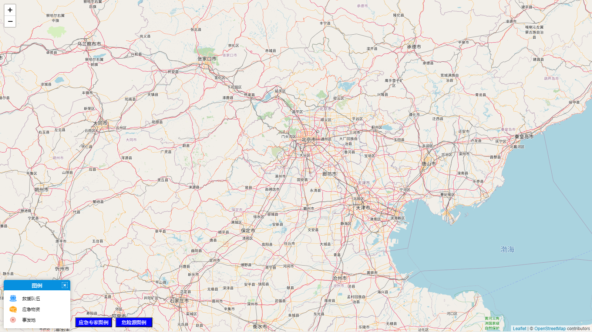
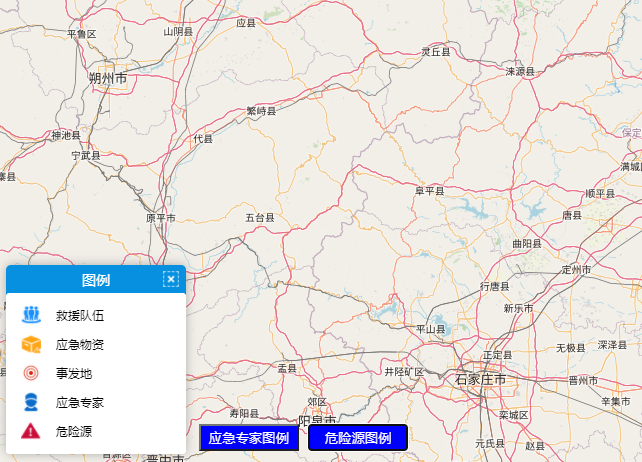
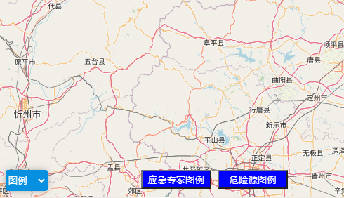

# leaflet-custom-legend

## Leaflet.Legend is a plugin for Leaflet that display legend symbols and toggle overlays.

<br>

# Demo

 
 
 

<br>

# Example

```js
    var map = L.map("map", {
        center: [39.597751, 116.201293],
        zoom: 8
    });
    
    var position = 'bottomleft',
    title = '图例',
    legendType = 'imgType',
    imgArr = [{
        url: './images/expert.png',
        size: [20, 20],
        label: '应急专家'
    }],
    colorArr = [],
    imgId = '应急专家'，
    colorId = ''

    this.legendCtrl = new L.Control.setLegend({
                    position: position,
                    title: title,
                    legendType: legendType,
                    imgArr: imgArr,
                    colorArr: colorArr,
                    imgId: imgId,
                    colorId: colorId 
                })
                this.legendCtrl.addTo(map)
```
<br>

# Options

|Option|Type|Default|Description|
|--|--|--|--|
|position|String|'topright'|图例控件位置,可选值为'topleft'、'bottomleft'、'topright'、'bottomright'|
|title|String|'图例'|图例标题|
|legendType|String|''|图例类型，可选值有两种，即图文式为'imgType'，颜色渐变式为'colorType'|
|ImgArr|Array|[]|图文型图例参数（对象数组，含图片url与文字描述）|
|colorArr|Array|[]|颜色型图例参数数组（对象数组，含颜色及对应文字描述）|
|imgId|String|''|所添加的img图例的唯一标识|
|clorId|String|''|所添加的color图例的唯一标识|